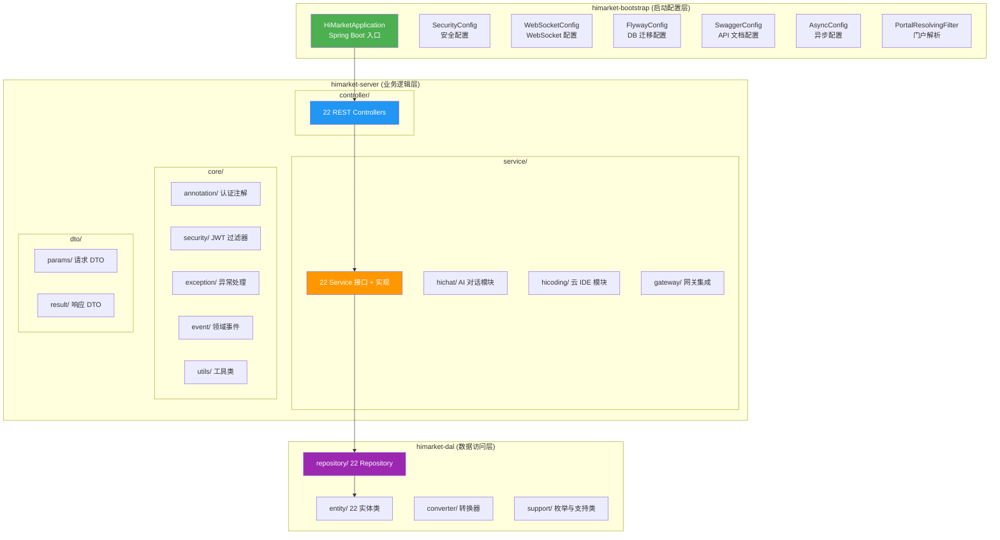
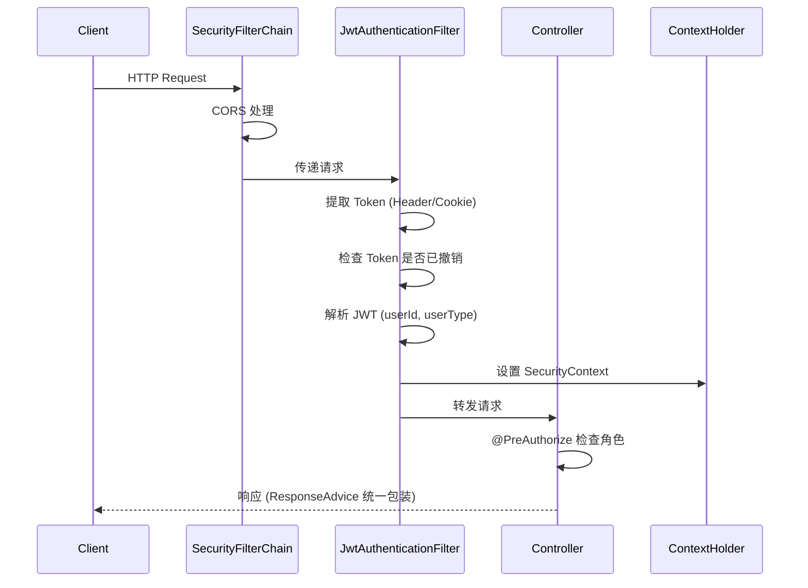
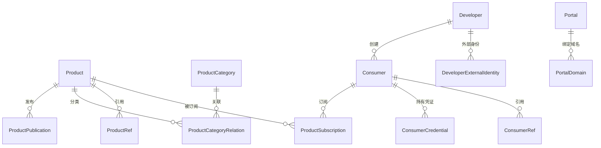

# HiMarket 系统架构

## 概述

HiMarket 是一个 AI 开放平台，提供 API 产品全生命周期管理、开发者门户、AI 对话助手、云端编程环境（HiCoding）等能力。基于 Java 17 + Spring Boot 3.2.11，采用 Maven 多模块分层架构。

## 模块架构



### 依赖方向

```
himarket-dal (底层，无内部依赖)
    ↑
himarket-server (中层，依赖 dal)
    ↑
himarket-bootstrap (顶层，依赖 server)
```

严格的单向依赖：上层可以依赖下层，下层不能依赖上层。

## 认证授权体系



### 认证注解

| 注解 | 对应角色 | 使用场景 |
|------|---------|---------|
| `@AdminAuth` | `ROLE_ADMIN` | 后台管理操作（产品创建/发布/删除等） |
| `@DeveloperAuth` | `ROLE_DEVELOPER` | 开发者操作（消费者管理、密码修改等） |
| `@AdminOrDeveloperAuth` | 两者皆可 | 共享操作（AI 对话、产品订阅等） |
| `@PublicAccess` | 无需认证 | 公开端点（产品列表、开发者注册等） |

### Token 机制

- 格式：JWT，含 userId + userType
- 有效期：7 天
- 签名密钥：`${JWT_SECRET}`
- 撤销机制：`RevokedToken` 表存储已撤销 token hash
- 获取位置：`Authorization: Bearer {token}` 或 Cookie

## 核心业务域

### 业务模块速查

| 业务域 | Controller | Service | Entity |
|--------|-----------|---------|--------|
| 管理员 | `AdministratorController` `/admins` | `AdministratorService` | `Administrator` |
| 开发者 | `DeveloperController` `/developers` | `DeveloperService` | `Developer` |
| 产品 | `ProductController` `/products` | `ProductService` | `Product`, `ProductPublication` |
| 消费者 | `ConsumerController` `/consumers` | `ConsumerService` | `Consumer`, `ConsumerCredential` |
| 门户 | `PortalController` `/portals` | `PortalService` | `Portal`, `PortalDomain` |
| 网关 | `GatewayController` `/gateways` | `GatewayService` | `Gateway` |
| Nacos | `NacosController` `/nacos` | `NacosService` | `NacosInstance` |
| AI 对话 | `ChatController` `/chats` (SSE) | `service/hichat/` | `Chat`, `ChatSession` |
| 云 IDE | `CodingSessionController` | `service/hicoding/` | `CodingSession` |

### WebSocket 端点

- `/ws/acp` — HiCoding 编程助手（`HiCodingWebSocketHandler`）
- `/ws/terminal` — 远程终端（`TerminalWebSocketHandler`）

### 产品管理

产品（Product）是平台的核心概念，代表一个可订阅的 API 服务。



产品类型包括：REST API、MCP Server、Agent API、Model API、Skill、Worker 等。

### AI 对话模块 (`service/hichat/`)

```
ChatController (SSE)
    → ChatService
        → ChatBotManager (管理对话上下文)
            → AbstractLlmService (LLM 策略基类)
                ├── DashScopeLlmService (通义千问)
                ├── OpenAILlmService (OpenAI 兼容)
                └── DashScopeImageLlmService (图像生成)
            → ToolManager (工具调用管理)
```

- 流式输出：Server-Sent Events (SSE)
- 多 LLM 支持：通过策略模式切换
- 工具调用：Function Calling 机制

### 云 IDE 模块 (`service/hicoding/`)

```
WebSocket /ws/acp
    → HiCodingWebSocketHandler
        → HiCodingMessageRouter (JSON-RPC 2.0 消息路由)
        → HiCodingConnectionManager (连接管理)
        → SessionInitializer (会话初始化)
        → RuntimeAdapter (运行时适配)
            └── RemoteWorkspaceService (远程沙箱)

WebSocket /ws/terminal
    → TerminalWebSocketHandler (终端 I/O)
```

- 消息格式：JSON-RPC 2.0
- 沙箱：远程 Docker 容器（支持 qwen-code, qodercli, claude-code, opencode）
- 功能：代码编辑、终端、文件系统操作

## 网关集成 (`service/gateway/`)

平台支持多种 API 网关集成：

| 网关类型 | 说明 |
|---------|------|
| APIG | 阿里云 API 网关 |
| Apsara | 专有云网关 |
| Higress | 开源云原生网关 |
| MSE | 微服务引擎 |

通过 `GatewayFactory` 工厂模式创建不同网关客户端。

## 事件驱动

使用 Spring Events 实现模块间松耦合通信：

| 事件 | 触发时机 | 作用 |
|------|---------|------|
| `ProductDeletingEvent` | 产品删除前 | 清理关联的发布、订阅等 |
| `PortalDeletingEvent` | 门户删除前 | 清理域名、关联配置 |
| `DeveloperDeletingEvent` | 开发者删除前 | 清理消费者、Token 等 |
| `ProductConfigReloadEvent` | 产品配置变更 | 通知网关重新加载 |
| `ChatSessionDeletingEvent` | 对话会话删除 | 清理聊天记录、附件 |
| `McpClientRemovedEvent` | MCP 客户端移除 | 清理 MCP 连接 |

## 数据持久化

- ORM：Spring Data JPA + Hibernate
- 数据库：MariaDB/MySQL
- 迁移：Flyway（V1 ~ V15），位于 `himarket-bootstrap/src/main/resources/db/migration/`
- 基础 Repository：`BaseRepository<T, ID> extends JpaRepository<T, ID>`

## 统一异常与响应处理

```
Controller 方法
    → 正常: ResponseAdvice 自动包装为 Response<T> {"code":"SUCCESS","data":{...}}
    → 异常: ExceptionAdvice 捕获
        → BusinessException: 返回对应 ErrorCode
        → 其他异常: 返回 500 + 错误信息
```

## 配置管理

主配置文件：`himarket-bootstrap/src/main/resources/application.yml`

关键环境变量：

| 变量 | 默认值 | 说明 |
|------|--------|------|
| `DB_HOST` | localhost | 数据库地址 |
| `DB_PORT` | 3306 | 数据库端口 |
| `DB_NAME` | himarket | 数据库名 |
| `DB_USERNAME` | root | 数据库用户 |
| `DB_PASSWORD` | 12345678 | 数据库密码 |
| `JWT_SECRET` | YourJWTSecret | JWT 签名密钥 |
| `ACP_DEFAULT_RUNTIME` | remote | HiCoding 运行时模式 |
| `ACP_REMOTE_HOST` | sandbox-shared | 沙箱主机 |

## 部署架构

### Docker Compose（开发/测试）

```
MySQL → Nacos → [Higress + Sandbox] → HiMarket Server → [Admin + Frontend]
```

### Kubernetes（生产）

通过 Helm Chart 部署，配置位于 `deploy/helm/himarket/`。
